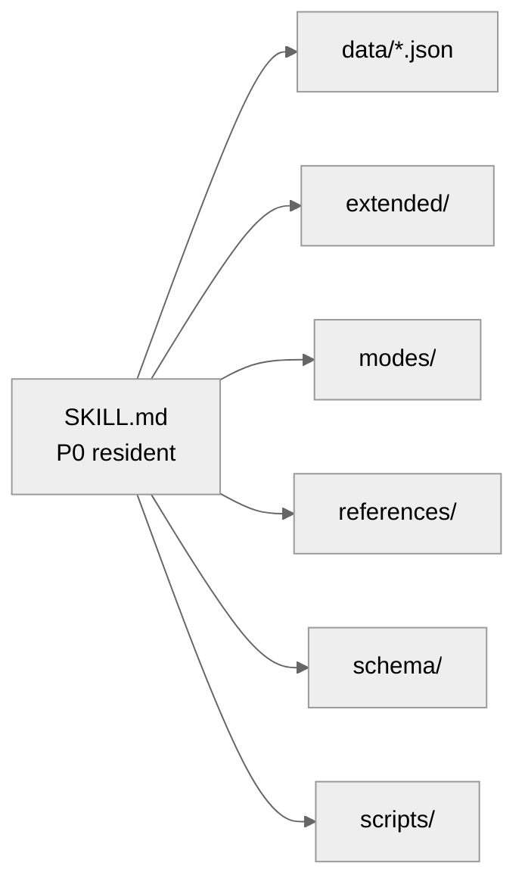

<p align="center">
  
  
</p>

# interactive-fiction

> **Complete interactive-fiction authoring spec v10.2.0** — turns any AI agent into a writer of tense, choice-driven, immersive stories.

> **Not "AI writes a novel for you" — it's "you choose, it writes."**
> You set the opening → the AI writes a segment and offers 5 choices → you pick → the story goes on.
> No deployment, no API keys, no code — drop it into your AI agent and play.

🌐 **[中文](README.md) | English**

[](LICENSE)
[](VERSION)

---

## ✨ What It Does

**interactive-fiction** teaches AI agents how to write interactive fiction — stories with choices, branches, and consequences, like a text adventure. No more one-way narration: every scene ends with choices that move the story forward.

*New to interactive fiction?* It's a story format where you make choices for the protagonist at each step (A/B/C/D/E), and the story branches based on your decisions — think "Choose Your Own Adventure," written live by an AI.

**What you get:**

- 🎭 **Every scene ends with choices**: A/B/C/D/E options after each segment; you can also type anything you'd say or do, and the story follows your lead
- 📖 **Three tones, switch anytime**: Mainline (steady), Immersion (pure story), Power Fantasy (fast-paced, satisfying reversals)
- 🎴 **Characters with depth**: Distill character cards from novels/games or create your own; the AI stays in character
- 💾 **Auto-saving progress**: Plot, affection, and side quests are tracked; resume after interruptions or export as a complete novel
- 🔍 **Continuity that holds**: the AI checks established facts and pays off planted hooks — long arcs stay consistent

---

## What's New (v10.2.0 · Memory Offload Assistant)

**📚 World-book style setting lookup (headline #1)**

- Your written world (`worldbuilding/`) and character cards (`characters/`) now **enter the per-turn brief when relevant**: mention a term like 「灵纹」 and its rule comes with it; walk into a town and its history does too
- Only the **few relevant entries** — nothing unrelated takes a line, so long novels run tens of thousands of words without the setting drifting
- With nothing relevant, the brief is **byte-for-byte identical** to before

**🧠 Long stories that keep their own notes**

- Optional **memory offload assistant**: word counts, segment counts, recaps and payoff bookkeeping are tallied for the AI, leaving it free to focus on the prose
- **Four-tier brief**: due consequences / long-term facts / recent changes / background state — what matters stays in view, small details don't crowd the page
- Background items fade on their own: flagged for two scenes, folded into one line, then quietly archived after six — **old business stops resurfacing in the narrative**
- The brief is reference only; it never makes narrative decisions for the author. Bookkeeping format is unchanged, so **existing saves keep working**
- Clients without a Python runtime fall back to the original flow — the story never stops

**🚪 Ready from the first message**

- Sending the trigger phrase now **always raises the opening menu** — no longer depends on the model remembering
- Steadier prose: the writing guide has a definite loading moment (entering a new chapter)
- Each turn's self-check is split into **pre-write prediction** and **post-write review**, so a bad paragraph is caught on the spot

**🐛 Stability fixes**

- Fixed: brief crash when two due consequences shared the same lag; bookkeeping aborted by a corrupted sidecar; missed due-reminders on legacy ledgers without segment counts; random-start saves unreadable; silent false success on string segment ids; word count double-counted after a failed write; brief crash on non-UTF-8 setting files
- Unit tests **56 → 73**, covering every fix above

**📐 Engineering**

- The ledger stays in `meta/novel_runtime.json`; assistant bookkeeping lives beside it in `meta/novel_assist.json`

---

## Install

### Option 1: npx skills

```bash
npx skills add Treasure-hub-agent/interactive-fiction-skill
```

> `npx skills` is a general agent-skill installer; if you don't have it, use Option 2.

### Option 2: Manual copy

Put the repo into your agent's skills directory:

| Client | Skills directory |
|--------|----------|
| Hermes | `~/.hermes/skills/creative/interactive-fiction/` |
| DeepSeek Harness (dsh) | `~/.dsh/skills/interactive-fiction/` |
| Generic convention (shared by agents) | `~/.agents/skills/interactive-fiction/` |
| Claude Code | `~/.claude/skills/interactive-fiction/` |
| Cursor | `~/.cursor/skills/interactive-fiction/` |

> Any client that can read `SKILL.md` can use this skill — just drop the folder into its skills directory (file read/write access is required; see Platform Support below).

Reload / restart your client, then send the trigger phrase to start a story.

### Option 3: Hermes users · skills tap

```bash
hermes skills tap add Treasure-hub-agent/interactive-fiction-skill
```

Once added, the skill shows up in `hermes skills browse` / `hermes skills search`; `hermes skills check` reports updates.

### Upgrade path

- npx: `npx skills update Treasure-hub-agent/interactive-fiction-skill` (or re-add)
- Manual: overwrite from the latest [GitHub Releases](https://github.com/Treasure-hub-agent/interactive-fiction-skill/releases), or overlay changed files (keep your runtime data directory)
- Upgrades never touch existing runtime data (saves and character cards live in a separate storage root)

> Deployment, upgrade and verification details: `references/deployment.md`.

---

## Why It's Needed

Naive AI fiction has a familiar litany of failure:

- ❌ Scene ends with **no choices** — the story becomes a one-way broadcast
- ❌ POV drifts; "you" and "he/she" blur together — readers fall out of the story
- ❌ Length wildly inconsistent; a tense fight gets 300 words, a dull day gets 2,000
- ❌ Characters are interchangeable; dialogue is generic filler
- ❌ Multiple threads contradict each other; saves and switches collapse

**With interactive-fiction**, all of the above become hard rules enforced by a pre-output self-check. The prose carries choices, POV discipline, length targets, and continuity out of the box.

---

## Core Capabilities

| Capability | Description |
|:-----|:-----|
| 🔴 Iron Rule #0 — choices | A/B/C/D/E after every scene (reference + fallback); free-form input is an equally valid (priority) driver; a scene never ends the conversation |
| 🎭 POV consistency | Hard rules for "I/you" vs "he/she"; formatting constraints for multi-character switches |
| 📏 Length windows | 500–1200 words main; 250–400 for tense fights; 800–1200 for emotional/atmospheric |
| 💾 Saves | Lightweight / persistent / milestone tiers; resume, switch stories, export |
| 🎴 Character cards | Pop, edit, deep-create, one-shots; minor characters get cards silently |
| 📖 Three modes | Mainline / Immersion / Power Fantasy |
| 🧩 P0/P1/P2 layering | Constant rules lean; on-demand loading; zero standing context cost |
| 🧠 Memory offload assistant | Optional: four-tier brief + auto-decay; word counts and ledgers tallied automatically |
| 🤖 Sub-agent mode | Optional: delegate prose generation (auto-falls back to main agent if unsupported) |

---

## Quick Start

1. Load the skill in your agent client (Hermes `skill_view`, Claude Code skill mechanism, etc.)
2. Send the trigger phrase → pick an opening route
3. Choose route A (reincarnate as a character from the original work) / B (create your own) / C (worldbuilder mode) / 🎲 random opening → the story begins
4. After each scene, pick A/B/C/D/E to advance
5. Send the help command anytime for the full command reference

> Works out of the box with the main agent producing scenes directly — no extra setup. Sub-agent mode and online distillation are optional enhancements.

---

## Storage & Permissions

The skill creates a storage root in your user directory (default `~/novels/`, overridable via env var `NOVEL_STORAGE_ROOT`) for:

- Novel saves and runtime state (`{story}/meta/novel_runtime.json`)
- Assistant bookkeeping (`{story}/meta/novel_assist.json`)
- Character cards (`{story}/characters/` and `通用角色卡/`)
- Distillation intermediates (`output/characters/`, gitignored)

**File read/write permission is required.** In environments without write access, the skill degrades gracefully (story continues, saves don't persist).

---

## Architecture



---

## Platform Fit

| Capability | Required? | If unsupported |
|------|--------|----------------|
| File read/write | ✅ Required | Saves silently degrade |
| Web search | ⚠️ Optional | Distillation falls back to model knowledge |
| Sub-task dispatch (sub-agent) | ⚠️ Optional | Auto-falls back to main agent |
| thinking mode | ⚠️ Optional | Works without; option reasoning slightly weaker |
| Python runtime | ⚠️ Optional | Memory offload assistant is skipped; original bookkeeping flow continues |

---

## FAQ

**Q: How is this different from a plain prompt?**
A: A plain prompt suggests; this skill enforces. Iron Rule #0, POV discipline, and length windows all have mandatory pre-output checks the AI runs every scene.

**Q: Version history?**
A: Runtime detail lives in `references/changelog.md`; a concise release history lives in `CHANGELOG.md` (appended at release time). The `VERSION` file is the single source of truth.

---

## Reading List

- [ai-with-u](https://github.com/Treasure-hub-agent/ai-with-u) — chat companion / character presence, zero system traces

---

## Content Notes

- This skill provides authoring specs for interactive fiction, supporting many genres and emotional arcs
- Relevant scenes are written per its description specs and emotional escalation rules
- The user is responsible for the content they create; this skill provides craft, not prescribed stories

---

## License

MIT License — free to use, modify, distribute. See [LICENSE](LICENSE). Version history in `references/changelog.md`.

---

> — Treasure-hub-agent · 2026 · Twelfth revision

---

## 🕮 Notes & License

- This skill provides an interactive-fiction authoring spec; mature themes are handled by the writing guidelines and emotional escalation rules
- **AI-generated content** — plots and characters are produced live by the model you configure; they do not represent the author's views, and you are responsible for how you use them
- **Data & privacy** — all runtime data (saves, character cards, ledgers) stays on your own device; nothing is uploaded, collected, or reported
- **Compliance** — for mature-themed material, ensure compliance with your local laws and platform rules
- **Models & cost** — bring your own model and runtime; costs and service terms are between you and your provider
- **No warranty** — provided "as is"; generation quality, continuity, and save safety are not guaranteed — please back up
- **MIT License** — free to use, modify, and distribute; keep the original copyright notice when redistributing
- Full terms: [`DISCLAIMER.en.md`](DISCLAIMER.en.md); changelog: `references/changelog.md`
