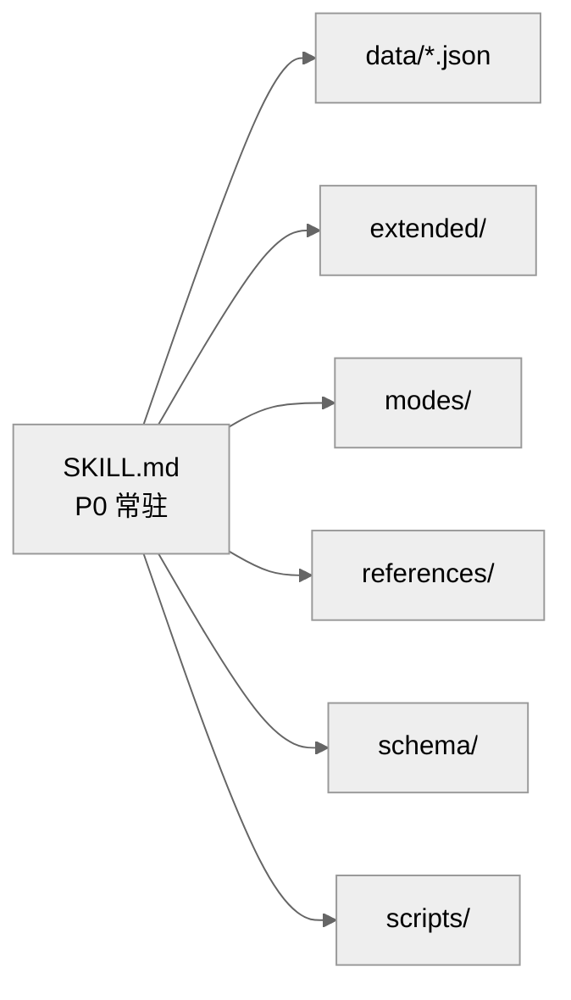

<p align="center">
  
  
</p>

<h1 align="center" style="font-family: 'Noto Serif SC', 'Songti SC', serif; font-size: 1.9em; letter-spacing: 0.08em; margin-bottom: 0.1em; margin-top: 0.6em;">
  interactive-fiction
</h1>

<p align="center" style="color:#8a7c6f;">
  —— 互动小说创作完整规范 v10.2.1 ——
</p>

<p align="center" style="color:#4a3f35;line-height:1.95;">
  <b>不是「AI 替你写小说」，是「你选，它写」。</b><br/>
  你说开头 → 它写一段 + 摆出 5 个选项 → 你选 → 接着演<br/>
  <span style="color:#8a7c6f;">不部署、不配 API、不写代码 —— 装进 AI 助手就能开演</span>
</p>

<p align="center">
  🌐 <b>中文</b> ｜ <a href="README.en.md">English</a>
</p>

<p align="center"><sub>
An AI-agent skill for interactive fiction — Chinese-first: choice-driven storytelling with 5 options per turn, long-novel consistency, save/load, and character cards.
</sub></p>

<p align="center">
  <a href="LICENSE"></a>
  <a href="VERSION"></a>
  <a href="https://github.com/Treasure-hub-agent/ai-with-u"></a>
</p>

---

## ✨ 一书 · 何以开头

**interactive-fiction** 是给 AI 用的「互动小说创作指南」——装上它，AI 就能写出一部有选项、有张力、有沉浸感的互动小说，像玩一场文字冒险游戏，却体验着商业软件般的打磨。

它为你拉开故事的舞台：

| | | |
|:---:|:---:|:---:|
| 🎭 **每个选择都有回应**<br/>A/B/C/D/E 五选项；亦可自由输入言行，故事随你而动 | 📖 **三种叙事调子**<br/>主线·沉浸·爽文，随心切换 | 🎴 **角色有血有肉**<br/>还原 / 自创 / 记忆人设，不走样 |
| 💾 **进度自动保存**<br/>剧情·好感·支线，断了能续，导出成书 | 🔍 **剧情不健忘**<br/>设定核对·伏笔回收·长线一致 | ✨ **文艺美学的守护**<br/>情感递进·语态基因·定情之后 |

---

## 📌 新卷 · v10.2.0 记忆外置助手

> 本栏目介绍最新版本的变化，只保留当前版本；历史版本见 `references/changelog.md`。

**📚 世界书式设定检索（本次重点之一）**

- 已经落盘的世界观（`worldbuilding/`）与角色卡（`characters/`）会在**相关时自动进入每轮简报**：说到「灵纹」就带出灵纹的规则，走到「边城」就带出边城的来历
- 只给**本轮相关的那几条**，无关设定一行不占——长篇小说跑几万字，设定也不会漂
- 无相关设定时简报与以前**逐字一致**，不影响任何现有体验

**🧠 长篇更省心：故事自己记得住**

- 新增可选的「记忆外置助手」：字数、段数、前情提要、后果回收交给它自动记账，AI 把心力留在写作上
- **四级记忆简报**：到期后果 / 长期事实 / 近期变化 / 背景状态分层呈现——要紧的事摆在眼前，琐碎的细节不占心神
- 背景事项会自动褪色：近两轮在变化区提示，随后合并为一行，六轮之后静静沉底——**旧事不会反复浮现在叙事里**
- 简报只作事实参考，不替作者做叙事决策；账本格式零改动，**已有存档无缝可用**
- 客户端没有 Python 运行环境时自动退回原有流程，**剧情不中断**

**🚪 打开就能玩**

- 发一句「加载小说包」**必定弹出开局菜单**，不再取决于模型是否想起来
- 写作风格写得更稳：写作指导文档有了明确的加载时机（进入新章节时）
- 每轮自检拆成「**落笔前预判**」+「**输出后核对**」，写崩了当场就能发现

**🐛 稳定性修复**

- 同一轮出现两条到期后果时的简报崩溃、辅助数据损坏导致记账中断、旧档缺少段计数导致后果提醒失效、随机开局存档读不到、写入失败后重试导致字数双计、非 UTF-8 设定文件导致简报崩溃
- 单元测试 **56 → 73 个**，覆盖上述全部修复路径

**📐 工程**

- 账本照旧在 `meta/novel_runtime.json`，助手簿记在 `meta/novel_assist.json`

---

## 🛠 如何入席 · 安装

### 方式 1：npx skills

```bash
npx skills add Treasure-hub-agent/interactive-fiction-skill
```

> `npx skills` 是通用的 agent skill 安装工具；没有的话直接用手动复制方式即可。

### 方式 2：手动复制

将仓库目录放入你的 agent 技能目录：

| 客户端 | 技能目录 |
|--------|----------|
| Hermes | `~/.hermes/skills/creative/interactive-fiction/` |
| DeepSeek Harness（dsh） | `~/.dsh/skills/interactive-fiction/` |
| 通用约定（多 agent 共用） | `~/.agents/skills/interactive-fiction/` |
| Claude Code | `~/.claude/skills/interactive-fiction/` |
| Cursor | `~/.cursor/skills/interactive-fiction/` |
| Operit（Android） | `/sdcard/Download/Operit/skills/interactive-fiction/` |

> 只要客户端能读取 `SKILL.md`，本 skill 就能用 —— 把目录放进它的技能目录即可（文件读写权限为必需项，见下方「平台表现」）。

复制后重新加载 / 重启客户端即可识别，发送「加载小说包」即可开局。

### 方式 3：Hermes 用户 · skills tap

```bash
hermes skills tap add Treasure-hub-agent/interactive-fiction-skill
```

添加后即可在 `hermes skills browse` / `hermes skills search` 中看到并安装本 skill，后续 `hermes skills check` 可检查更新。

### 方式 4：Operit（Android）用户

Operit 自带 Skill 管理，全程不用命令行：

1. 打开 `包管理 → Skills`（或点右下角商店图标进市场直接搜本 skill）
2. 点 `+` → 选「仓库」，填 `https://github.com/Treasure-hub-agent/interactive-fiction-skill`（也可选「ZIP」导入发布包）
3. 确认该条目右侧开关处于**开启**状态，发「加载小说包」开局

> 小说数据落在 `/sdcard/Download/Operit/novels/`（与技能目录分开），升级或重装技能不影响存档。记忆外置助手需要 Python 环境；没有也能玩，会自动走 AI 直接读写运行时文件的原路径。

### 升级路径

- npx 安装：`npx skills update Treasure-hub-agent/interactive-fiction-skill`（或重新 add）
- 手动复制：以最新 [GitHub Releases](https://github.com/Treasure-hub-agent/interactive-fiction-skill/releases) 发布包整体覆盖，或增量覆盖变更文件（保留你的运行数据目录即可）
- 升级不影响已有运行数据（小说存档、角色卡存放于独立存储目录）

> 部署、升级与验证详见 `references/deployment.md`。

---

## 🕮 为何翻开这一页

让 AI 写互动小说，最常见的问题：

> ❌ 每轮正文结束**忘了给选项**，剧情变成单向广播
> ❌ 主角视角漂移，「你」和「他/她」混着用，读者出戏
> ❌ 字数忽长忽短，紧迫战斗 300 字、日常水了 2000 字
> ❌ 角色千人一面，剧情全靠套话
> ❌ 剧情开了多条线，后文互相矛盾，存档/切换一塌糊涂

**用了 interactive-fiction 之后**：以上问题全部变成硬性规则，由 AI 每轮输出前强制自检，写出来的正文自带选项、视角、字数、一致性保障。**落笔即合律，行文有法度。**

---

## 📖 内页 · 核心能力

| 能力 | 说明 |
|:-----|:-----|
| 🔴 铁律 #0 选项机制 | 每轮正文输出后强制跟 A/B/C/D/E 五选项（参考指引+兜底），自由输入等权/优先推进；正文结束不结束对话 |
| 🎭 视角一致性 | 主角「我/你」、对象「他/她」切换有硬规则，多角色切换有格式约束 |
| 📏 字数区间 | 500-1200 字主区间，紧迫战斗 250-400 字，情感/氛围 800-1200 字 |
| 💾 存档系统 | 轻量/持久/里程碑三档，断连恢复、切换小说、导出 |
| 🎴 角色卡系统 | 弹出/修改/深度创建/短篇，配角静默落卡 |
| 📖 三种模式 | 主线（mainline）/ 沉浸（immersion）/ 爽文（shuangwen） |
| 🧩 P0/P1/P2 分层 | 常驻规则精简，按需加载，上下文零持续负担 |
| 🧠 记忆外置助手 | 可选：四级简报 + 自动衰减，字数与账本自动记账，长篇设定不遗忘也不反复干扰 |
| 🤖 子 Agent 模式 | 可选：子任务派发生成正文（不支持时自动主 Agent 直出） |

---

## 🚩 开场 · 快速开始

1. 用你的客户端加载本 skill（如 Hermes 的 `skill_view`、Claude Code 的 skill 机制）
2. 发送「加载小说包」→ 进入开局路线选择
3. 选路线 A（穿越成原著角色）/ B（自创角色）/ C（创世模式）/ 🎲 随机开局 → 开始正文
4. 每轮正文后从 A/B/C/D/E 选一个推进剧情
5. 随时发送「帮助」查看使用指南（全量指令速查）

> 提示：本 skill 默认由主 Agent 直出正文，无需任何额外配置即可使用。子 Agent 模式、联网蒸馏等为可选增强。

---

## 📚 存放 · 存储与权限

本 skill 会在存储根目录下创建数据（桌面宿主默认 `~/novels/`，手机端 `/sdcard/Download/Operit/novels/`；可用环境变量 `NOVEL_STORAGE_ROOT` 覆盖），用于存放：

- 小说存档与运行时状态（`{小说名}/meta/novel_runtime.json`）
- 助手簿记（`{小说名}/meta/novel_assist.json`）
- 角色卡（`{小说名}/characters/` 与 `通用角色卡/`）
- 蒸馏中间产物（`output/characters/`，会被 .gitignore 忽略）

**需要 agent 具备文件读写权限**。无文件写权限的环境会静默降级（不中断叙事，但存档不落盘），请确保你的运行环境允许写文件。

---

## 🏛 架构 · 书的骨架



```
interactive-fiction/
├── SKILL.md              # P0 常驻核心规则（铁律、视角、字数、选项）
├── MANIFEST.json         # 文件清单 + SHA256 校验
├── VERSION               # 当前版本号
├── assets/               # 视觉资源（banner.svg 等）
├── data/                 # 标签词库 / 字数区间 / 指令路由 / 随机池
├── docs/                 # 设计文档与版本规划（不参与运行时加载）
├── extended/             # P1/P2 按需加载：角色卡、蒸馏、事件、存储
├── modes/                # 主线/沉浸/爽文三种模式
├── references/           # 指令导航、写作指南、使用指南、切换规则等
├── schema/               # 运行时 JSON Schema
└── scripts/              # 工程门禁 validate.py / MANIFEST 生成
```

---

## 🖥 适配 · 平台表现

| 能力 | 必需？ | 不支持时的表现 |
|------|--------|----------------|
| 文件读写 | ✅ 必需 | 存档不落盘（静默降级） |
| 联网搜索 | ⚠️ 可选 | 蒸馏走「模型知识优先」降级路径 |
| 子任务派发（子 Agent） | ⚠️ 可选 | 自动降级为主 Agent 直出 |
| thinking 模式 | ⚠️ 可选 | 关闭后仍可用，选项推理质量略降 |
| Python 运行环境 | ⚠️ 可选 | 记忆外置助手跳过，走原有记账流程，剧情不中断 |

---

## ❓ 问与答

**Q: 和普通 prompt 写小说有什么区别？**
A: 普通 prompt 是「建议」，本 skill 是「硬规则 + 自检清单」。铁律 #0（选项必跟）、视角规则、字数区间都有强制自检步骤，AI 每轮输出前逐项核对。

**Q: 版本历史？**
A: 运行时详细变更说明见 `references/changelog.md`；面向 GitHub / Releases 的精简版本史见根目录 `CHANGELOG.md`（发版时追加）。版本号以 `VERSION` 文件为唯一权威。

---

## 📖 同卷 · 延伸阅读

- [ai-with-u](https://github.com/Treasure-hub-agent/ai-with-u) —— 聊天搭子 / 角色陪伴，零系统痕迹

---

## 🕮 说明与版权

- 本 skill 提供互动小说创作规范，支持多种题材与情感张力描写；涉及相关场景时按描写规范与情感递进执行
- **内容由 AI 生成** —— 所有剧情与人物由你所配置的模型实时产出，不代表作者观点；创作内容责任由使用者自负
- **数据与隐私** —— 运行时数据（存档、角色卡、账本）全部保存在你自己的设备上，不上传、不收集、不回传
- **合规提示** —— 涉及成人向题材时，请自行确保符合所在地法律法规与发布平台规则
- **模型与费用** —— 模型与运行环境需自备，相关费用与服务条款由你与服务商处理
- **无担保** —— 按「现状」提供，不保证生成质量、连续性与存档安全，建议自行备份
- **MIT License** —— 可自由使用、修改、分发；分发时请保留原始版权声明
- 完整条款见 [`DISCLAIMER.md`](DISCLAIMER.md)；版本变更记录见 `references/changelog.md`

---

<p align="right" style="color:#8a7c6f;">
  —— Treasure-hub-agent · 2026 · 第十二次修订
</p>