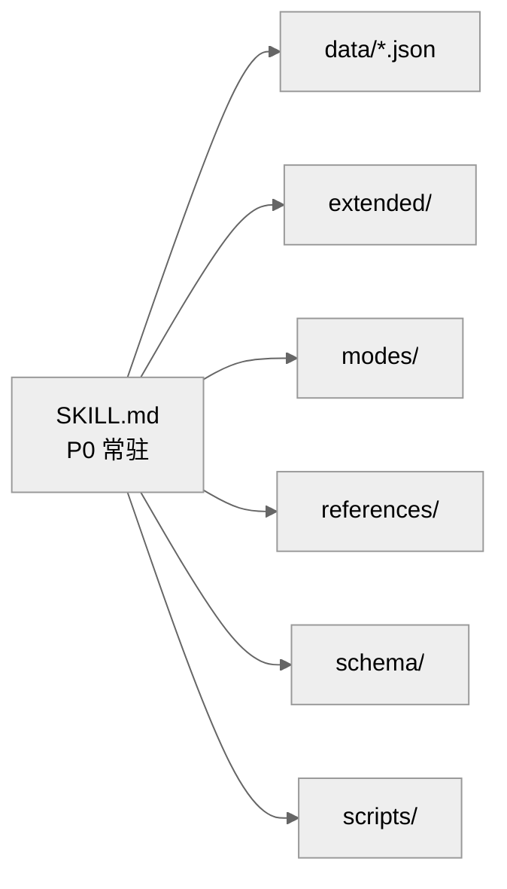

<p align="center">
  
</p>

# interactive-fiction

> **互动小说创作完整规范 v10.1.0**
>
> 以选项为笔墨，以剧情为山河 —— 让 AI agent 写出「有选项、有张力、有沉浸感」的互动小说。

🌐 **中文 | [English](README.en.md)**

[](LICENSE)
[](VERSION)

> 💡 **dsh-story 插件用户**：本 skill 将随 `dsh-story` 插件捆绑发布（开发中），装插件即装 skill，无需手动安装；插件升级时 skill 随之更新。

---

## ✨ 它是什么

给 AI 用的「互动小说创作指南」——装上它，AI 就能写出带选项、带剧情的互动小说，像玩文字冒险游戏一样，体验媲美专业商业软件。

它能为你做什么：

- 🎭 **每个选择都有回应**：每段剧情后 AI 都会给出 A/B/C/D/E 选项；你也可以直接输入想说的话、想做的事，AI 会顺着你的思路继续写
- 📖 **三种口味随时切换**：主线（稳扎稳打）、沉浸（纯剧情、无干扰）、爽文（快速打脸、爽点密集）
- 🎴 **角色有血有肉**：可以从小说 / 游戏里还原角色卡，也可以自己捏角色；AI 会记住人设，不会越写越跑偏
- 💾 **进度自动保存**：剧情、好感、支线都会自动记录，断了能接着玩，还能导出成完整小说文本
- 🔍 **剧情不健忘**：AI 会自动核对设定、回收伏笔，长剧情也不会前后矛盾

---

## 📌 当前版本动态（v10.1.0 · 定情之后）

> 本栏目介绍最新版本的变化，只保留当前版本；历史版本见 `references/changelog.md`。

**💗 定情之后，故事仍在继续（本次重点）**

- 情感叙事从「心动 → 暧昧 → 定情」三阶段，延伸到 **「定情之后」**：日常亲密 / 共同决策 / 冲突 / 和解 四档场景
- 双锚定触发：关系进入「定情」且你提到日常、明天、未来、一起…… AI 自动切换到定情后语态
- 角色语态不再停格在告白那一刻——**沉淀型 / 释放型 / 震荡型 / 恒定型**四类演变范式，让 TA 在关系中继续生长

**📖 长篇不再健忘**

- 每章自动生成「章摘要」（≤200 字），每 5 章自动生成「卷总结」（≤1000 字）
- 「章回顾」「卷回顾」指令随时调出，追 50 章也不迷路
- 摘要可手动校准（`generated_by` 标记），永远由你掌握最终版本

**🧭 指令与工程**

- 标签池切换有了明确决策树（emotion / emotion_daily / general 三池互斥），AI 不再猜
- `validate.py` 工程门禁升级：自动校验 emotion_daily 结构 + 决策树引用完整性

---

## 安装

### 方式 1：npx skills

```bash
npx skills add Treasure-hub-agent/interactive-fiction-skill
```

> `npx skills` 是通用的 agent skill 安装工具；没有的话直接用手动复制方式即可。

### 方式 2：手动复制

将仓库目录放入你的 agent 技能目录：

| 客户端 | 技能目录 |
|--------|----------|
| Hermes | `~/.hermes/skills/creative/interactive-fiction/` |
| Claude Code | `~/.claude/skills/interactive-fiction/` |
| Cursor | `~/.cursor/skills/interactive-fiction/` |

复制后重新加载 / 重启客户端即可识别，发送「加载小说包」即可开局。

### 方式 3：DSH 插件内安装（dsh-story 插件捆绑，开发中）

`dsh-story` 插件将捆绑本 skill（开发中）：安装 / 升级该插件即自动安装 / 升级 skill，无需手动复制。

### 升级路径

- npx 安装：`npx skills update Treasure-hub-agent/interactive-fiction-skill`（或重新 add）
- 手动复制：以最新 [GitHub Releases](https://github.com/Treasure-hub-agent/interactive-fiction-skill/releases) 发布包整体覆盖，或增量覆盖变更文件（保留你的运行数据目录即可）
- dsh-story 插件（开发中）：随插件升级自动更新
- 升级不影响已有运行数据（小说存档、角色卡存放于独立存储目录）

> 部署、升级与验证详见 `references/deployment.md`。

---

## 为什么需要它

让 AI 写互动小说，最常见的问题：

- ❌ 每轮正文结束**忘了给选项**，剧情变成单向广播
- ❌ 主角视角漂移，「你」和「他/她」混着用，读者出戏
- ❌ 字数忽长忽短，紧迫战斗 300 字、日常水了 2000 字
- ❌ 角色千人一面，剧情全靠套话
- ❌ 剧情开了多条线，后文互相矛盾，存档/切换一塌糊涂

**用了 interactive-fiction 之后**：以上问题全部变成硬性规则，由 AI 每轮输出前强制自检，写出来的正文自带选项、视角、字数、一致性保障。

---

## 核心能力

| 能力 | 说明 |
|:-----|:-----|
| 🔴 铁律 #0 选项机制 | 每轮正文输出后强制跟 A/B/C/D/E 五选项（参考指引+兜底），自由输入等权/优先推进；正文结束不结束对话 |
| 🎭 视角一致性 | 主角「我/你」、对象「他/她」切换有硬规则，多角色切换有格式约束 |
| 📏 字数区间 | 500-1200 字主区间，紧迫战斗 250-400 字，情感/氛围 800-1200 字 |
| 💾 存档系统 | 轻量/持久/里程碑三档，断连恢复、切换小说、导出 |
| 🎴 角色卡系统 | 弹出/修改/深度创建/短篇，配角静默落卡 |
| 📖 三种模式 | 主线（mainline）/ 沉浸（immersion）/ 爽文（shuangwen） |
| 🧩 P0/P1/P2 分层 | 常驻规则精简，按需加载，上下文零持续负担 |
| 🤖 子 Agent 模式 | 可选：子任务派发生成正文（不支持时自动主 Agent 直出） |

---

## 快速开始

1. 用你的客户端加载本 skill（如 Hermes 的 `skill_view`、Claude Code 的 skill 机制）
2. 发送「加载小说包」→ 进入开局路线选择
3. 选路线 A（穿越成原著角色）/ B（自创角色）/ C（创世模式）/ 🎲 随机开局 → 开始正文
4. 每轮正文后从 A/B/C/D/E 选一个推进剧情
5. 随时发送「帮助」查看使用指南（全量指令速查）

> 提示：本 skill 默认由主 Agent 直出正文，无需任何额外配置即可使用。子 Agent 模式、联网蒸馏等为可选增强。

---

## 存储与权限

本 skill 会在你的用户目录下创建存储根目录（默认 `~/novels/`，可通过环境变量 `NOVEL_STORAGE_ROOT` 覆盖），用于存放：

- 小说存档与运行时状态（`{小说名}/meta/novel_runtime.json`）
- 角色卡（`{小说名}/characters/` 与 `通用角色卡/`）
- 蒸馏中间产物（`output/characters/`，会被 .gitignore 忽略）

**需要 agent 具备文件读写权限**。无文件写权限的环境会静默降级（不中断叙事，但存档不落盘），请确保你的运行环境允许写文件。

---

## 架构



```
interactive-fiction/
├── SKILL.md              # P0 常驻核心规则（铁律、视角、字数、选项）
├── MANIFEST.json         # 文件清单 + SHA256 校验
├── VERSION               # 当前版本号
├── assets/               # 视觉资源（banner.svg 等）
├── data/                 # 标签词库 / 字数区间 / 指令路由 / 随机池
├── docs/                 # 设计文档与版本规划（不参与运行时加载）
├── extended/             # P1/P2 按需加载：角色卡、蒸馏、事件、存储
├── modes/                # 主线/沉浸/爽文三种模式
├── references/           # 指令导航、写作指南、使用指南、切换规则等
├── schema/               # 运行时 JSON Schema
└── scripts/              # 工程门禁 validate.py / MANIFEST 生成
```

---

## 平台适配

| 能力 | 必需？ | 不支持时的表现 |
|------|--------|----------------|
| 文件读写 | ✅ 必需 | 存档不落盘（静默降级） |
| 联网搜索 | ⚠️ 可选 | 蒸馏走「模型知识优先」降级路径 |
| 子任务派发（子 Agent） | ⚠️ 可选 | 自动降级为主 Agent 直出 |
| thinking 模式 | ⚠️ 可选 | 关闭后仍可用，选项推理质量略降 |

---

## 常见问题

**Q: 和普通 prompt 写小说有什么区别？**
A: 普通 prompt 是「建议」，本 skill 是「硬规则 + 自检清单」。铁律 #0（选项必跟）、视角规则、字数区间都有强制自检步骤，AI 每轮输出前逐项核对。

**Q: 版本历史？**
A: 运行时详细变更说明见 `references/changelog.md`；面向 GitHub / Releases 的精简版本史见根目录 `CHANGELOG.md`（发版时追加）。版本号以 `VERSION` 文件为唯一权威。

---

## 延伸阅读

- [ai-with-u](https://github.com/Treasure-hub-agent/ai-with-u) —— 聊天搭子 / 角色陪伴，零系统痕迹
- [dsh-story](https://github.com/Treasure-hub-agent/dsh-story) —— 即将捆绑本 skill 的插件

---

## 内容说明

- 本 skill 提供互动小说创作规范，支持多种题材与情感张力描写
- 涉及相关场景时按描写规范与情感递进执行
- 创作内容责任由使用者自负；本 skill 提供创作规范，不预设具体故事内容

---

## 版权

- MIT License，可自由使用、修改、分发
- 版本变更记录见 `references/changelog.md`

---

> — Treasure-hub-agent · 2026 · 第十一次修订